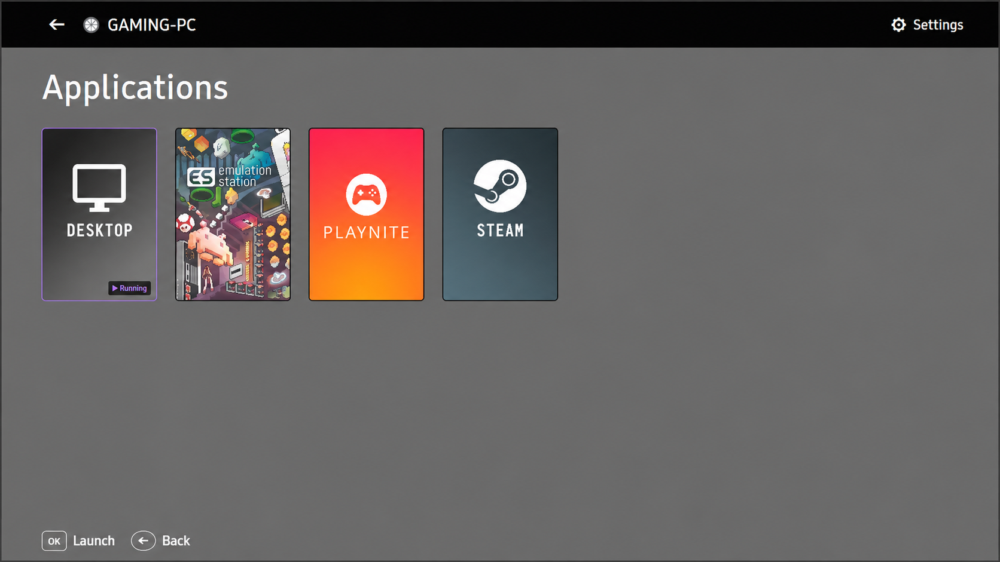
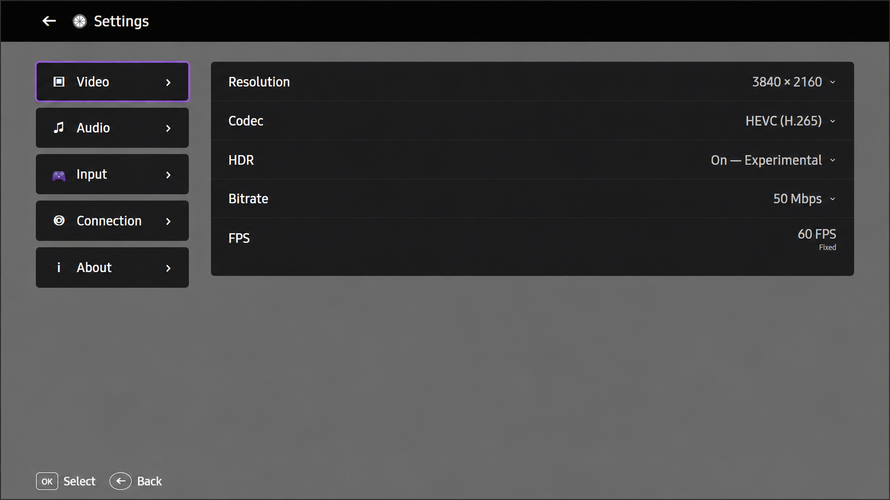
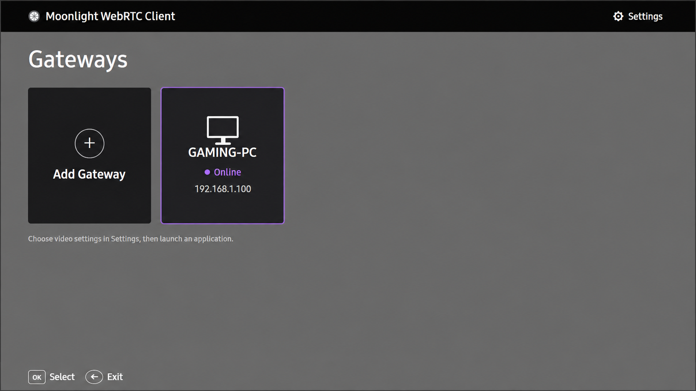
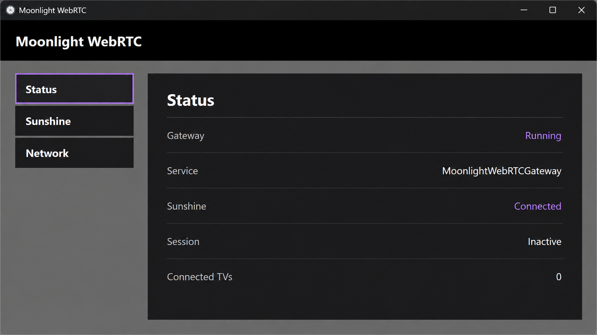

# Moonlight WebRTC

### Sunshine game streaming for Samsung Tizen TVs

**Moonlight WebRTC brings low-latency PC game streaming to Samsung TVs with up to 4K 60 FPS, HDR, HEVC, gamepad support, rumble, and a TV-first interface.**

It keeps Sunshine and the Moonlight protocol where they work best, then bridges the already encoded stream to the TV through WebRTC — **without decoding and re-encoding the video on the Gateway**.

> [!IMPORTANT]
> **Moonlight WebRTC is currently in beta.**  
> It is intended for testing on compatible Samsung Tizen TVs and may still contain bugs or device-specific limitations.



**4K 60 FPS · HDR · HEVC Main10 · H.264 · Opus audio · Gamepad + rumble · No video transcoding**

---

## What is Moonlight WebRTC?

Moonlight WebRTC lets you play games from a Sunshine-powered Windows PC directly on a Samsung Tizen TV.

Install the **Moonlight WebRTC Gateway** on your Windows PC, pair it once with Sunshine, install the TV app, and then use your Samsung remote or gamepad to browse your library and start streaming from the couch.

The TV does **not** connect directly to Sunshine.

Instead, Moonlight WebRTC splits the job into two parts:

```text
Gaming PC
┌─────────────────────────────┐
│          Sunshine           │
└──────────────┬──────────────┘
               │
               │ Moonlight protocol
               ▼
┌─────────────────────────────┐
│   Moonlight WebRTC Gateway  │
│       Windows service       │
└──────────────┬──────────────┘
               │
               │ WebRTC over your LAN
               ▼
┌─────────────────────────────┐
│      Samsung Tizen TV       │
│       Moonlight WebRTC      │
└─────────────────────────────┘
```

From Sunshine's point of view, the Gateway is the Moonlight client. From the TV's point of view, the Gateway is a local WebRTC streaming server.

That architecture lets Moonlight WebRTC keep the mature Sunshine/Moonlight ecosystem on the PC side while using the real-time media path available on Samsung Tizen TVs.

---

# Features

## 🎮 Browse and launch your Sunshine library

Moonlight WebRTC retrieves your Sunshine applications and their artwork and presents them in a TV-friendly library.

From the TV you can:

- browse Sunshine applications;
- view application artwork;
- launch a game;
- resume an existing session;
- disconnect from the stream while leaving the game running;
- stop the Sunshine session when you actually want to close it;
- switch to another application.

The session lifecycle is designed to behave like a normal Moonlight client rather than simply killing the host application whenever the TV disconnects.

---

## 📺 Up to 4K 60 FPS

The current beta streams at a fixed **60 FPS** and supports several resolution and codec combinations.

| Codec | 720p | 1080p | 1440p | 4K |
|---|:---:|:---:|:---:|:---:|
| H.264 | ✅ | ✅ | — | — |
| HEVC Main | ✅ | ✅ | 🧪 | ✅ |
| HEVC Main10 HDR | — | ✅ | 🧪 | ✅ |

🧪 **1440p is currently considered experimental.**

Resolution, codec, HDR mode and bitrate are selectable directly from the TV.



---

## 🌈 HDR

Moonlight WebRTC supports **HEVC Main10 HDR** streaming without tone mapping or video transcoding in the Gateway.

The HDR path preserves the Main10 stream and Rec.2020 signaling through to the Samsung TV.

Validated HDR modes include:

- 1080p60;
- 1440p60 experimental;
- 4K60.

---

## ⚡ No video transcoding

This is one of the most important design goals of Moonlight WebRTC.

Sunshine already produces an encoded game stream. The Gateway does **not** decode that video and create a second encoded stream.

A traditional transcoding bridge would look like this:

```text
Sunshine
   ↓
encoded video
   ↓
Gateway decodes
   ↓
Gateway re-encodes
   ↓
TV decodes
```

Moonlight WebRTC instead uses this path:

```text
Sunshine
   ↓
H.264 / HEVC encoded video
   ↓
Moonlight WebRTC Gateway
packetize / forward
   ↓
WebRTC
   ↓
Samsung hardware decoder
```

Avoiding an additional decode/encode cycle means:

- no extra generation of video compression;
- no unnecessary quality loss from re-encoding;
- no additional full transcoding delay;
- much lower CPU/GPU requirements for the Gateway.

The Gateway is primarily a **protocol and transport bridge**, not a video transcoder.

---

## 🔊 Synchronized audio and video

Audio is delivered as **Opus stereo at 48 kHz**.

Instead of maintaining unrelated custom audio and video playback loops on the TV, Moonlight WebRTC feeds both through the WebRTC media pipeline.

WebRTC provides a shared real-time media timeline and handles mechanisms such as:

- media timing;
- jitter buffering;
- audio/video synchronization;
- packet-loss feedback;
- stream timing adjustments.

That design helps maintain tight A/V synchronization during gameplay without adding a second custom synchronization layer on Tizen.

---

## 🎮 Gamepad support

Xbox-compatible controllers can be used directly with the Samsung TV.

Supported input includes analog sticks, triggers, D-pad, face buttons, shoulder buttons, stick buttons, menu/view controls and **controller rumble**.

Gamepad input travels back to the Gateway through a **WebRTC DataChannel** and is forwarded through the Moonlight input protocol to Sunshine.

---

## 🛋️ Designed for the TV

The Samsung application is built around a remote-first interface rather than adapting a desktop UI to a television.

It includes:

- multiple saved Gateways;
- online/offline Gateway status;
- remote-friendly IPv4 editing;
- Sunshine application artwork;
- resolution selection;
- codec selection;
- HDR selection;
- bitrate configuration;
- stream controls;
- launch and resume progress feedback.

No keyboard is required for normal use.



---

## 🖥️ Windows Gateway and tray application

The Gateway runs as a Windows service, so it is available independently of the desktop UI.

A separate tray application provides configuration and status for the interactive Windows session.

From the tray you can:

- configure the Sunshine host;
- test the Sunshine connection;
- pair with Sunshine;
- unpair;
- inspect Gateway status;
- inspect network and session information.

The service starts automatically with Windows.



---

## 🖥️ Your PC display stays untouched

Moonlight WebRTC deliberately does **not** enable Sunshine/Moonlight host game optimizations that change the Windows display configuration.

Starting a stream does not intentionally change your host resolution, refresh rate or HDR configuration.

Your gaming PC remains configured the way you left it.

---

# Why WebRTC?

A reasonable question is:

> **Why not just run a normal Moonlight client directly on the Samsung TV?**

Moonlight is already an excellent low-latency game-streaming protocol, and Moonlight WebRTC still uses it.

**WebRTC does not replace Moonlight in this project.**

The challenge is the final part of the path: getting the stream into a Samsung Tizen television efficiently.

Traditional Moonlight clients are built around the native networking, input and hardware-decoding APIs available on their target platforms. Samsung Tizen TVs expose a different application environment, while also providing a WebRTC-oriented real-time media path suitable for interactive streaming.

Moonlight WebRTC therefore uses both technologies where they make the most sense:

```text
Sunshine                                      Samsung TV
    │                                             ▲
    │ Moonlight                                   │ WebRTC
    │                                             │
    └────────────► Moonlight WebRTC Gateway ──────┘
```

The Gateway handles everything that belongs to the Moonlight ecosystem:

- client identity;
- Sunshine pairing;
- application discovery;
- artwork retrieval;
- launch / resume / stop requests;
- Moonlight stream negotiation;
- encoded video and audio reception;
- controller input forwarding.

The TV uses WebRTC for the final hop over the local network.

## Why this architecture matters

### Low latency without a transcoding stage

WebRTC is **not** being used to encode the game again.

The already encoded Moonlight video is forwarded into the WebRTC transport path. That avoids an additional video encoding stage on the Gateway.

This matters because a decode → re-encode bridge would add avoidable processing delay and another lossy compression stage.

```text
Sunshine encode
      ↓
Moonlight transport
      ↓
Gateway forwards encoded media
      ↓
WebRTC transport
      ↓
Samsung hardware decode
```

### Tight audio/video synchronization

WebRTC transports audio and video as related real-time media streams.

That gives the Samsung media stack a shared timing model for both streams rather than relying on two independent playback pipelines.

The result is a cleaner architecture for maintaining low-latency A/V synchronization during gameplay.

### Real-time media feedback

WebRTC also provides mechanisms designed for live media transport, including jitter handling, packet-loss feedback, RTP timing, keyframe requests and real-time transport statistics.

When the Samsung side requests a new keyframe, the Gateway can propagate that request back into the Moonlight stream.

### Hardware decoding stays on the TV

The Gateway does not render the game.

The Samsung TV receives the encoded stream and performs final video decoding through its own media pipeline.

That keeps the Gateway lightweight enough to run alongside Sunshine on the gaming PC without becoming a second video-rendering or transcoding workload.

---

# Quick start

You need:

1. **Sunshine** on your Windows gaming PC.
2. **Moonlight WebRTC Gateway** on Windows.
3. **Moonlight WebRTC** on your Samsung TV.

Download the latest beta from the [GitHub Releases page](https://github.com/tsoas/moonlight-webrtc-tizen/releases).

## 1 — Install the Windows Gateway

Download `MoonlightWebRTC-Setup.exe` and run the installer.

It installs the Moonlight WebRTC Gateway Windows service, the tray application and the required local-subnet Windows Firewall rule.

The Gateway service starts automatically with Windows.

## 2 — Pair the Gateway with Sunshine

Open the **Moonlight WebRTC** tray application.

Go to **Sunshine**, configure the Sunshine host and select **Test Connection**.

Then select **Pair** and complete the PIN pairing with Sunshine.

Pairing normally only needs to be performed once.

## 3 — Install the Samsung TV application

Download `MoonlightWebRTC.wgt`.

Install it with [Apps2Samsung](https://github.com/Apps2Samsung/Apps2Samsung) using its **Custom WGT** installation option.

Apps2Samsung handles the Tizen signing and TV installation process.

**Tizen Studio is not required for normal beta installation.**

## 4 — Add your Gateway

Open Moonlight WebRTC on the Samsung TV.

Gateway discovery is not available yet, so select **Add Gateway** and enter the LAN IPv4 address of the Windows PC running the Gateway.

The TV and PC must be reachable on the same local network.

Once connected, your Sunshine application library should appear. Select an application and start streaming.

---

# Installation details

## Windows

`MoonlightWebRTC-Setup.exe` installs Moonlight WebRTC under:

```text
C:\Program Files\Moonlight WebRTC
```

The installer creates the Windows service:

```text
MoonlightWebRTCGateway
```

which runs automatically under the Windows `LocalService` account.

It also installs the tray application for the current interactive user.

### Windows Firewall

The installer automatically creates an inbound Windows Firewall rule named `Moonlight WebRTC Gateway`.

The rule:

- applies only to `moonlight_webrtc.exe`;
- accepts connections only from `LocalSubnet`;
- applies across Windows firewall profiles.

You should **not disable Windows Firewall** or manually change your Windows network profile to use Moonlight WebRTC.

## Samsung Tizen

The beta release provides `MoonlightWebRTC.wgt`.

Use Apps2Samsung to install the WGT on the TV and follow its instructions for Developer Mode, TV connection, signing and custom WGT installation.

Once installation is complete, Moonlight WebRTC should appear in the Samsung application list.

---

# Streaming controls

Moonlight WebRTC distinguishes between disconnecting from a stream and stopping the host application.

## Disconnect

Ends the current TV ↔ Gateway streaming connection. The Sunshine application continues running on the PC, so you can reconnect later and resume it.

## Stop

Requests Sunshine to terminate the current application session. Use this when you actually want to stop the game on the PC.

## Launch another application

When switching to another Sunshine application, Moonlight WebRTC ends the previous Sunshine session before launching the new one.

---

# Persistent Gateway data

The Gateway stores its identity and Sunshine pairing information in:

```text
%PROGRAMDATA%\MoonlightWebRTC
```

This directory contains sensitive client identity material, including the Gateway certificate/private key and Sunshine pairing state.

**Do not share or publish this directory.**

The Windows uninstaller intentionally preserves it, so a normal uninstall/reinstall retains the existing Sunshine pairing.

---

# Current beta limitations

Moonlight WebRTC is still under active development.

Current known limitations include:

- streaming is currently fixed at **60 FPS**;
- Gateway auto-discovery is not implemented;
- Gateways must currently be added manually by IPv4 address;
- Wake-on-LAN is not implemented;
- 1440p support is experimental;
- automatic application updates are not currently provided.

Higher refresh-rate streaming is being investigated separately and is not enabled in this beta.

---

# Troubleshooting

## The TV cannot connect to the Gateway

Check that:

- the **Moonlight WebRTC Gateway** service is running;
- the TV and PC are on the same LAN;
- the Gateway IPv4 address entered on the TV is correct;
- the PC is reachable from the TV network.

The Windows installer creates the required local-subnet firewall rule automatically.

**Do not disable Windows Firewall as a troubleshooting step.**

## Sunshine is not paired

Open the Moonlight WebRTC tray application and go to the **Sunshine** page.

Use **Test Connection** first, then perform **Pair** again if required.

## Reinstalling did not reset the pairing

This is intentional. The Gateway identity in `%PROGRAMDATA%\MoonlightWebRTC` is preserved by the uninstaller.

---

# Release downloads

Beta releases contain:

```text
MoonlightWebRTC-Setup.exe
MoonlightWebRTC.wgt
MoonlightWebRTC-Source.tar.gz
SHA256SUMS.txt
LICENSE
THIRD_PARTY_NOTICES.md
```

`SHA256SUMS.txt` can be used to verify the downloaded binaries and source archive.

On Windows:

```powershell
Get-FileHash .\MoonlightWebRTC-Setup.exe -Algorithm SHA256
Get-FileHash .\MoonlightWebRTC.wgt -Algorithm SHA256
Get-FileHash .\MoonlightWebRTC-Source.tar.gz -Algorithm SHA256
```

Compare the results with the hashes contained in `SHA256SUMS.txt`.

---

# Building from source

The project uses C++20, CMake, `moonlight-common-c`, `libdatachannel`, OpenSSL, libcurl, pugixml and Samsung Tizen tooling.

The Windows Gateway and Samsung TV application have separate packaging pipelines.

For GPL-compliant release source, each release also includes `MoonlightWebRTC-Source.tar.gz`, containing the corresponding Moonlight WebRTC source and the exact `moonlight-common-c` revision used by that release.

---

# Acknowledgements

Moonlight WebRTC would not exist without the work of the wider Moonlight, Sunshine and Tizen communities.

Special thanks to:

- **[BrightCraft / Moonlight Tizen](https://github.com/brightcraft/moonlight-tizen)**  
  BrightCraft's Moonlight Tizen project was an important reference during the development of Moonlight WebRTC. Parts of its Tizen-side code were reused and adapted, and its UI concepts and implementation ideas provided useful guidance while exploring how to build a modern Moonlight experience for Samsung TVs. Its long-running work on Moonlight for Tizen provided a strong foundation and many valuable lessons for this project.

- **[Moonlight Game Streaming Project](https://github.com/moonlight-stream)**  
  For the Moonlight protocol implementation and `moonlight-common-c`, which form the basis of the Gateway's communication with Sunshine.

- **[Sunshine](https://github.com/LizardByte/Sunshine)**  
  For providing the open-source GameStream host that Moonlight WebRTC connects to.

- **Samsung Tizen / Samsung Developers**  
  For the Tizen platform, WebRTC APIs and developer tooling that make the Samsung TV client possible.

Moonlight WebRTC takes a different architectural approach from traditional Moonlight Tizen clients — using a Windows Moonlight Gateway and WebRTC for the final hop to the television — but it builds on a significant amount of prior open-source work from these projects.

---

# License

Moonlight WebRTC is licensed under the **GNU General Public License version 3**.

See:

- [LICENSE](LICENSE)
- [THIRD_PARTY_NOTICES.md](THIRD_PARTY_NOTICES.md)

for project licensing and third-party dependency information.
